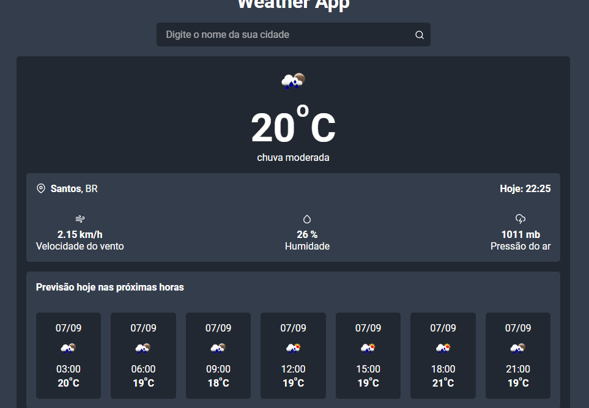

# Weather App 



Esta é uma aplicação que permite visualizarmos dados climáticos em tempo real de acordo com o nome do local pesquisado. 
A api utilizada para consultar os dados climáticos é a [Openweathermap.](https://openweathermap.org/)

Nesta aplicação os dados escolhidos para serem retornados pela api são:

- Temperatura atual;
- Situação do tempo. Exemplo: Nublado, poucas nuvens e etc;
- Velocidade do vento;
- Humidade;
- Pressão do ar;
- Previsão da temperatura nos próximos 7 horários adiante em relação ao que foi pesquisado.

## Passo a passo para rodar o projeto local

1. Clone o repositório.
```bash
git clone https://github.com/Matheus2004a/Weather-App.git
```

2. Entre no repositório.
```bash
cd Weather-App
```

3. Baixe todos os pacotes.
```bash
npm install
```

4. Execute o projeto localmente
```bash
npm run dev
```